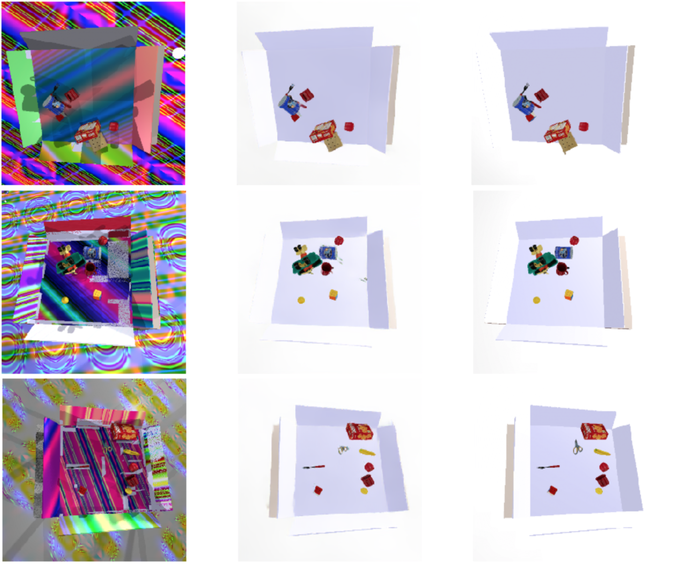
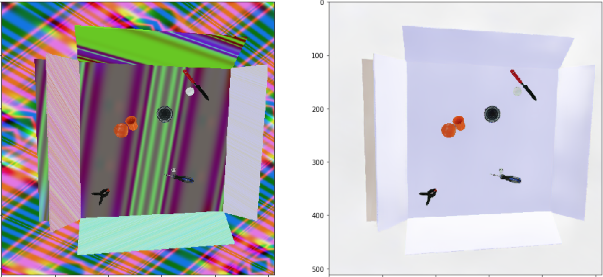
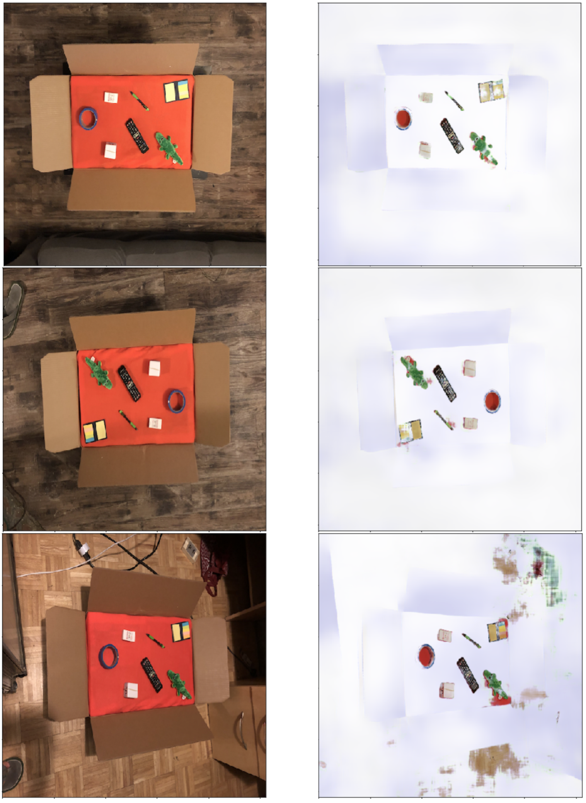
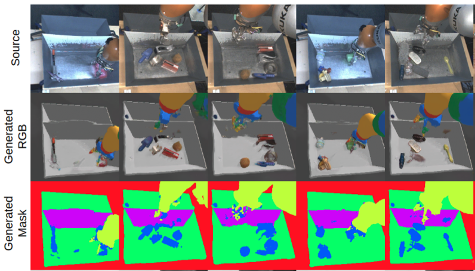

# ran2can

This repository contains all of the tools necessary to replicate the following results:

![static/sim2real_paper_frontimg.png][static/sim2real_paper_frontimg.png]

The project is insiped by [James et al., 2019 - Sim-to-Real via Sim-to-Sim: Data-efficient Robotic Grasping via Randomized-to-Canonical Adaptation Networks](https://arxiv.org/abs/1812.07252). However, instead of training a GAN loss, it uses a [Perceptual (Feature) Loss](https://arxiv.org/abs/1603.08155) objective.  model, which is usually used for image segmentation tasks. In this case, instead of classifying each pixel (i.e. predict the segmentation mask), we will make the model convert a domain-randomized image into a canonical (non-randomized) version.

I did not have a robotic arm, hence it's only trained on box with random objects.

Here is an example of **input, output and ground-truth**:

__*Sim-to-sim - (randomized simulated image to canonical):*__

__*Real-to-sim - (real photo to canonical) - :*__

\* note model has never seen these objects in the scene, hence the noise.

For a reference here are the results from the original paper (they also have a mask generated):

# TODO:
- [ ] Upload requirements.txt
- [ ] Instructions for image generation
- [ ] Instructions for model training

Credits:
* [V-REP](http://coppeliarobotics.com)
* [fast.ai U-net](https://docs.fast.ai/vision.models.unet.html)
* [fast.ai feature loss](https://course.fast.ai/videos/?lesson=7)